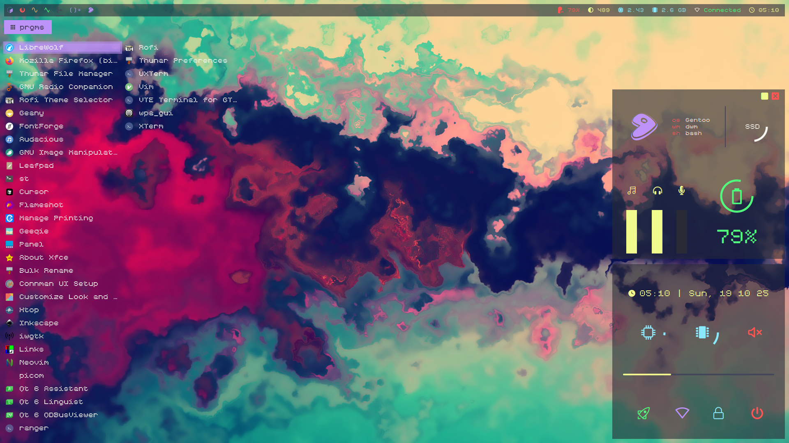
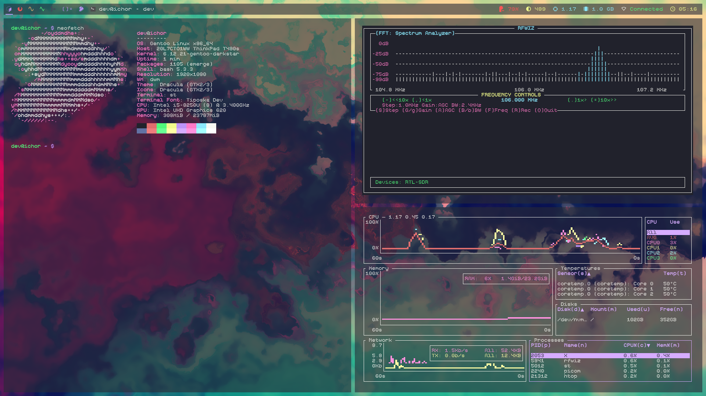

# 🧠 devwm — A heavily customized chadwm/dwm fork for Gentoo.


**devwm** is a heavily customized fork of [chadwm](https://github.com/siduck/chadwm), tailored for Gentoo users who want a more aesthetic dwm rice. It integrates transparency, fading effects, EWW widget toggling, and a custom Rofi theme — all modified with Gentoo in mind, but can be adapted to other distros.

## ✨ Features

- **Alpha Patch for Transparency**  
  Enables true window transparency using the official [alpha patch](https://dwm.suckless.org/patches/alpha/), compatible with picom.

- **WindowMap Patch for Fading**  
  Adds smooth fade-in/out transitions to window events, enhancing visual polish.

- **EWW Toggle Keybind**  
  A custom keybinding allows you to show/hide EWW widget instantly.

- **Custom Rofi Theme**  
  Includes a personalized Rofi configuration with transparency, left-centered layout, and modern styling.

## 📸 Screenshots

Here’s devwm in action:



## 📦 Dependencies

Make sure the following packages are installed:
- `JetBrains Mono Nerd Fonts/Icons` (This is used for the icons mostly)
- `Tiposka Font` (OR replace All Instances of "Tiposka" a different font of choice.)
- `picom` (recommended for transparency and fading)
- `eww` (for widgets)
- `rofi` (with custom theme)
- `feh`
- `acpi`
- `dash` (shell)
- `imlib2`
- `xsetroot package` (status2d uses this to add colors on dwmbar)


## ⚙️ Installation

### .sh scripts
- Do chmod +x to all shcripts

### Clone and Build

```bash
git clone https://github.com/1ch0r/devwm ~/.config/devwm
cd ~/.config/devwm/devwm
sudo make clean install
cd ~/.config/devwm
cp -r eww ~/.config/
cp -r rofi ~/.config/
```
### Start devwm
- startx ~/.config/devwm/scripts/run.sh (for startx)
- sx sh ~/.config/devwm/scripts/run.sh (for sx)

## With Display Manager:

Create a desktop entry (make sure to change user with your user):

```bash
sudo touch /usr/share/xsessions/devwm.desktop
```
```
[Desktop Entry]
Name=devwm
Comment=dwm for short
Exec=/home/user/.config/devwm/scripts/./run.sh 
Type=Application 
```

## ⌨️ Basic Keybindings
- MOD + w:	Toggle EWW bar
- MOD + q:  Quit active window
- MOD + Enter:	Launch terminal
- MOD + r:	Launch Rofi
- MOD + f:	Launch ranger
- MOD + u:  Launch flameshot


## Patches

  - `alpha` (added new in devwm)
  - `windowmap` (added new in devwm)
  - `systray`
  - `barpadding`
  - `bottomstack`
  - `cfacts`
  - `dragmfact`
  - `dragcfact` (took from bakkeby's build)
  - `fibonacii`
  - `gaplessgrid`
  - `horizgrid`
  - `movestack`
  - `vanity gaps`
  - `colorful tags`
  - `statuspadding`
  - `status2d`
  - `underline tags`
  - `notitle`
  - `winicon`
  - `preserveonrestart` (This patch doesnt let all windows mix up into tag 1 after restarting dwm.)
  - `shiftview`

## ! DISCLAIMER
Eww's setup is extremely messy due to chadwm's original unintuitive configuration.

